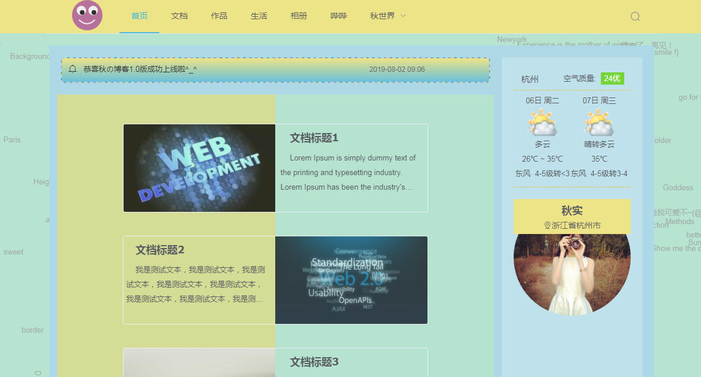
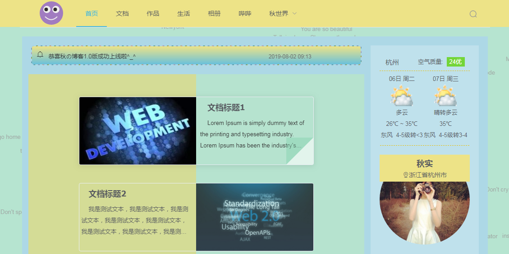

# 秋实の博客
### 我要一步一步向上爬，在最高点乘着叶片往前飞，小小的天流过的泪和汗，总有一天我有属于我的天……

# 功能介绍
1. svg背景图片制作，亮点：全屏任意位置出现不同中、英短语，鼠标触及时出现任意效果。
2. 整个项目响应式，这个没什么好说的了，最基本的功能。
3. 导航条上svg绘制了个小脑袋，会转转眼珠，会自己变脸色。后期计划给她再增加些创意。
4. 调用了三方的天气接口，可以显示访问客户当地近三天天气。
5. 还在开发中，后面还会有留言板，小聊天室，以及博客后台等等。

# 技术栈
+ 前端采用：
vue、vue-router、elementui、scss、svg、axios...
+ 服务端采用：
mongoose、express、node

# 项目本地启动
+ 服务端：my-blog\server 中 node server.js 启动服务
+ 前  端：my-blog 中 npm run dev 启动vue

# 项目目录说明
+ components:存放公用组件
+ views:存放项目主体页面
+ static:存放第三方插件，三方引入的代码，很少改动的，不必每次打包的
+ server:后台代码

# 哔哩哔哩
+ 纯属工作之余抽时间来开发，暂时只能截图给大家看看，还在开发中。。。
+ 整体页面色调，布局的思考好纠结，天秤座的选择综合征又犯了，设计自己的博客真心操碎了心，啥有趣的功能都想玩一把。
+ 感觉好像把博客项目设计的太大了，但是又舍不得砍掉，总想把所有功能都自己前后端通吃玩一遍才甘心，算了，慢慢做了 ε=(´ο｀*)))

